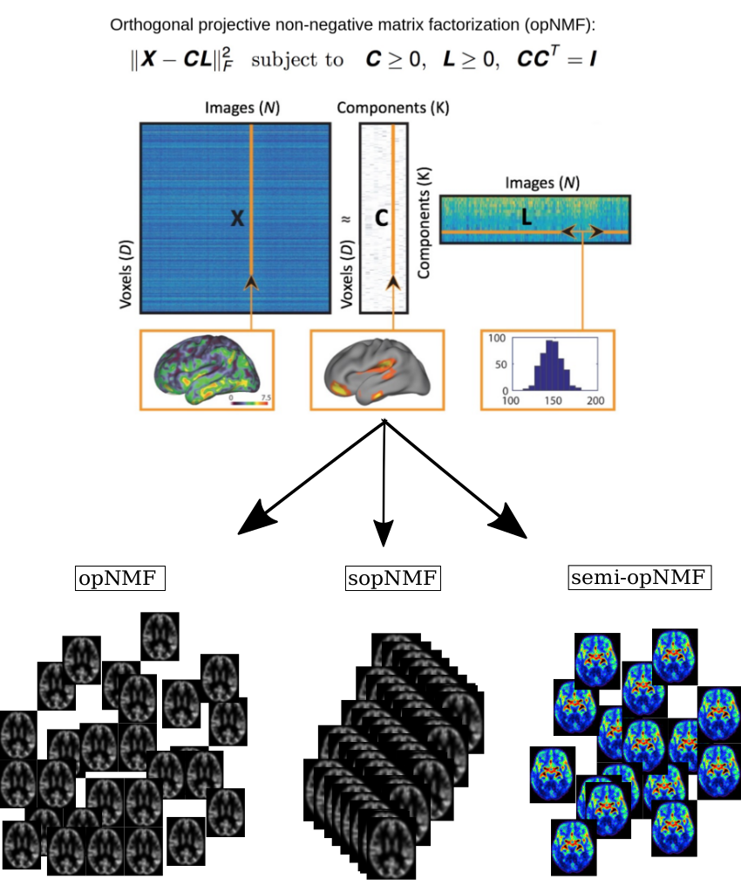

# `OPNMF`
**OPNMF** is the fast python implementation of the Orthogonal Projective Non-negative Matrix Factorization: [brainparts](https://github.com/asotiras/brainparts). Compared to the matlab implementation, OPNMF is much computationally faster and extends to its stochastic version to overcome the memory limitation and to its semi version to deal with mixed-sign signals.

In a nutshell, **OPNMF** has three algorithms: i) original opNMF model, ii) sopNMF, and iii) semi-opNMF.


## License
Copyright (c) 2016 University of Pennsylvania. All rights reserved. See https://www.cbica.upenn.edu/sbia/software/license.html.

## Installation
[Ananconda](https://www.anaconda.com/products/individual) allows you to install, run and update python package and their dependencies. We highly recommend the users to install **Anancond3** on your machine.
After installing Anaconda3, there are three choices to use OPNMF.
### Use OPNMF as a python package
We recommend the users to use Conda virtual environment:
```
1) conda create --name OPNMF python=3.6
```
Activate the virtual environment:
```
2) source activate OPNMF
```
Install other python package dependencies (go to the root folder of OPNMF):
```
3) ./install_requirements.sh
```
Finally, we need install OPNMF from PyPi (**Not yet avaible now, but you can run the functions after step 3)**):
```
4) pip install pyOPNMF==0.0.1
```

### Use OPNMF from commandline:
```
pip install -e .
```

### Use OPNMF as a developer version:
```
python -m pip install git+https://github.com/anbai106/OPNMF.git
```

## Input structure
OPNMF requires the input (*participant_tsv*) to be a specific structure inspired by [BIDS](https://bids.neuroimaging.io/). The 3 columns in the tsv are **participant_id**, **session_id** and **path**, respectively.

Example for participant tsv:
```
participant_id    session_id    path
sub-CLNC0001      ses-M00      absolute_path    
sub-CLNC0002      ses-M00      absolute_path
sub-CLNC0003      ses-M00      absolute_path
sub-CLNC0004      ses-M00      absolute_path
sub-CLNC0005      ses-M00      absolute_path
sub-CLNC0006      ses-M00      absolute_path
sub-CLNC0007      ses-M00      absolute_path
sub-CLNC0008      ses-M00      absolute_path
```

## Examples for usage

### First, training the original opNMF (soNMF or semi-opNMF):
```
from opnmf.opnmf_core import opnmf
participant_tsv="path_to_participant_tsv"
output_dir = "path_output_dir"
tissue_binary_mask = "path_to_tissue_mask"
num_component_min = 2
num_component_max = 60
n_threads = 8
verbose = True
opnmf(participant_tsv, output_dir, tissue_binary_mask, num_component_min, num_component_max, n_threads=n_threads, verbose=verbose)
```

### Second, applying the trained model to the training data for post-analyses:
```
from opnmf.opnmf_post import apply_to_training
output_dir = "path_output_dir"
tissue_binary_mask = "path_to_tissue_mask"
num_component = 2
apply_to_training(output_dir, num_component, tissue_binary_mask, verbose=True)
```

### Last, you may also apply the trained model to unseen test data:
```
from opnmf.opnmf_post import apply_to_test
participant_tsv="path_to_participant_tsv"
tissue_binary_mask = "path_to_tissue_mask"
num_component = 2
output_dir = "path_output_dir"
apply_to_test(output_dir, num_component, tissue_binary_mask, participant_tsv, verbose=True)
```

## Citing this work
> Sotiras, A., Resnick, S.M. and Davatzikos, C., 2015. **Finding imaging patterns of structural covariance via non-negative matrix factorization**. Neuroimage, 108, pp.1-16. [doi:10.1016/j.neuroimage.2014.11.045](https://www.sciencedirect.com/science/article/pii/S1053811914009756?via%3Dihub)

## Usage demonstration
> Wen, J., Varol, E., Davatzikos, C., 2021. **Multi-scale semi-supervised clustering of brain images: deriving disease subtypes**. Submitted to MedIA. - [Link](https://www.biorxiv.org/content/10.1101/2021.04.19.440501v1)
